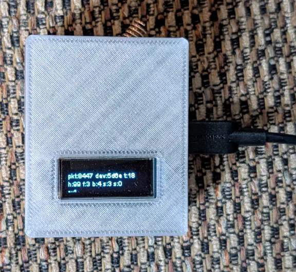
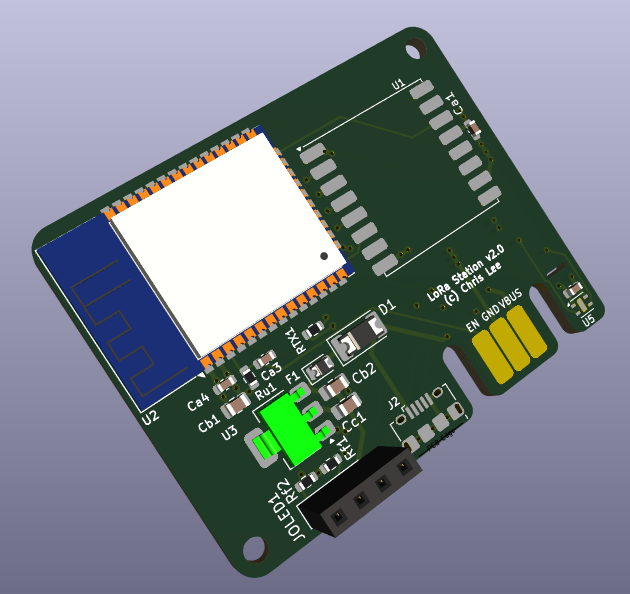
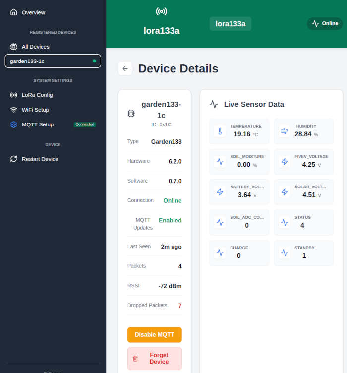

# LoRa133

This project is a base station for LoRa-based satellite sensor devices such as [Garden133](https://github.com/chl33/Garden133).  It includes KiCAD board design and C++ firmware.  LoRa133 allows satellite sensor units to communicate using LoRa radio modules and automatically integrate with Home Assistant.  I build the firmware using the [Platformio](https://platformio.org/) build system.

This is a picture of the base station in its project box in [`OpenSCAD/Lora133/`](OpenSCAD/Lora133/).

This is the PCBA documented in [`KiCAD/LoRa133/`](KiCAD/LoRa133/).

Here is what the web interface (written in Svelte) looks like:

Please see the [Introducing Garden133](https://selectiveappeal.org/posts/garden133/) blog post for more information.

This device uses these libraries:
- [og3](https://github.com/chl33/og3). A basic C++ library for esp development in the Arduino environment.
- [og3x-lora](https://github.com/chl33/og3x-lora). LoRa module support for the og3 library.
- [og3x-satellite](https://github.com/chl33/og3x-satellite). A library that helps build a satellite architecture of a base station and satellite sensors.

## What's New in v0.7.0

*   **Satellite Memory**: The bridge now persists its satellite network knowledge across reboots. Restarts no longer result in a blank device list.
*   **Enhanced Visibility**: Real-time RSSI, packet counts, and human-readable "Last Seen" timers added to the web dashboard.
*   **Mobile Optimized**: Fully responsive web interface that fits perfectly on smartphone screens.
*   **og3 v0.6.1 Core**: Modernized backend leveraging the latest declarative dependency and file storage improvements.

