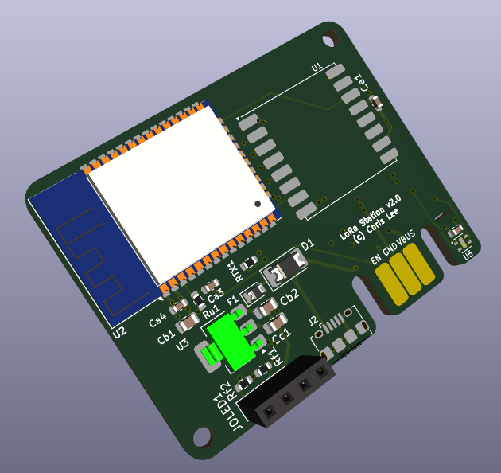

# LoRa133

This project is a base station for LoRa-based satellite sensor devices such as [Garden133](https://github.com/chl33/Garden133).  It includes KiCAD board design and C++ firmware.  LoRa133 allows satellite sensor units to communicate using LoRa radio modules and automatically integrate with Home Assistant.  I build the firmware using the [Platformio](https://platformio.org/) build system.

This is a picture of the base station in its project box in [`OpenSCAD/Lora133/`](OpenSCAD/Lora133/).

This is the PCBA documented in [`KiCAD/LoRa133/`](KiCAD/LoRa133/).

Please see the [Introducing Garden133](https://selectiveappeal.org/posts/garden133/) blog post for more information.

This device uses these libraries:
- [og3](https://github.com/chl33/og3). A basic C++ library for esp development in the Arduino environment.
- [og3x-lora](https://github.com/chl33/og3x-lora). LoRa module support for the og3 library.
- [og3x-satellite](https://github.com/chl33/og3x-satellite). A library that helps build a satellite architecture of a base station and satellite sensors.

More details to follow!
